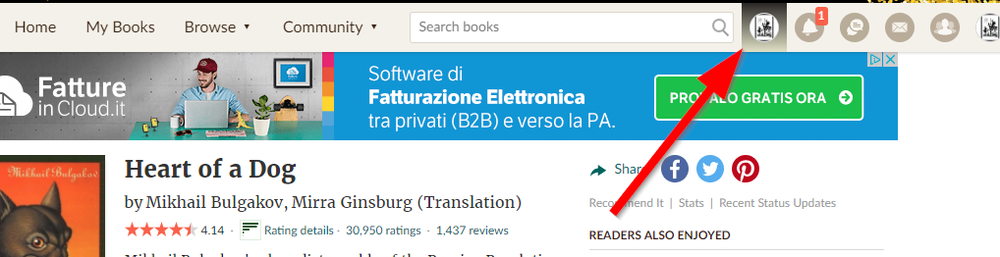
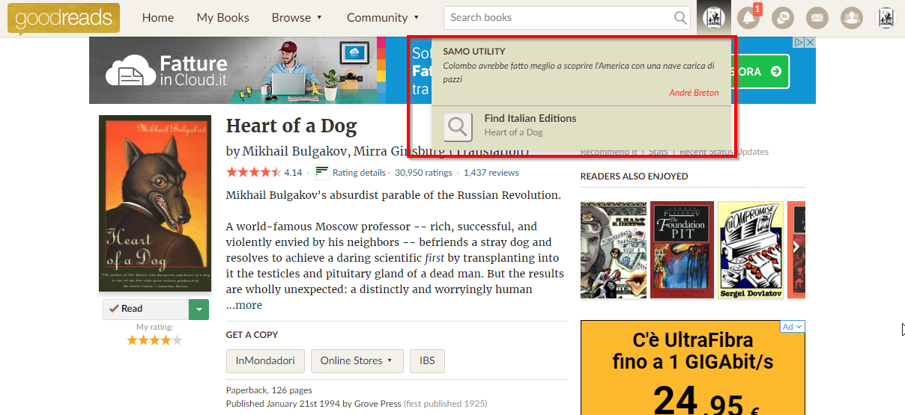

# :books: Goodreads Utility (version 1.4)
Add some utilities to Goodreads site https://www.goodreads.com/

## Table of contents
- [Installation](#installation)
- [Utilities list](#utilities)
- [Soon next features](#utilitiesnext)
- [Versions history](#versions)
- [Known limitations and bugs](#bugs)
- [Developers: todo](#devtodo)
***


# <a name="installation">:wrench: Installation</a>
[show Installation video (on iPad)](https://drive.google.com/file/d/1gnZtnvcJKyLXSIRJGKNTpa0OE24PblL0/view?usp=drivesdk)
1) Add a :bookmark: Bookmark "Goodreads Utility" to your browser
   - copy and paste this javascript code into the bookmark URL
      - by default this installation language is *Italian*
         > samoGoodreadsUtility={'lang':'ita'}
         
      - you can change language by replacing the 'lang' value **ita** with one of this [languages](https://asamorini.github.io/goodreads.utility/docs/languages.txt)
      
      ```
      javascript:var samoGoodreadsUtility={'lang':'ita'};(function(){var s=document.createElement('SCRIPT');s.type='text/javascript';s.src='https://asamorini.github.io/goodreads.utility/dist/goodreads.utility.min.js';document.getElementsByTagName('head')[0].appendChild(s);})();
      ```
2) and now, when you are visiting www.goodreads.com/ site
   - if you click the bookmark "Goodreads utility" a new menu will be shown
      
   - click on it to see utilities
      
      
> Notes:
>   - :bulb: if you are synchronizing web browser bookmarks between your devices (example: pc and mobile phone and tablet), you need to install only on one browser
>   - :bulb: after you have installed on your browser, you always use the last version, and receive automatically updates (so to become aware of new features, connected to this site)
>   - :bulb: how I can be updated of new features? From the new menù, near the title "GOODREADS UTILITY" the current version is showed, you can click it to open this documentation page, and check [Versions history](#versions)

***


# <a name="utilities">:heavy_check_mark: Utilities List</a>
* **Books list: replace books to the corresponding edition of specific language**
   * Author page - [show demo video](https://drive.google.com/file/d/12YgEMhwExuduRZhCcqoEVqN8jyD9FBvx/view?usp=drivesdk)
      * author's books list
   * Books by author page - [show demo video](https://drive.google.com/file/d/1WFOd9GlGz5jVLK05nOdmKtNLVnxoNpzj/view?usp=drivesdk)
      * author's books list
   * Listopia pages (Listopia and Listopia voted by user...) - [show demo video](https://drive.google.com/file/d/1pMsskXttQ85H1bP53cpw5JHEfZ50ghrC/view?usp=drivesdk)
      * books of this list
   * Recommendations pages (Recommendations,Recommendations by shelf,Recommendations by genre) - [show demo video](https://drive.google.com/file/d/1o9SWyE2mf3qv2fSwmoRRJeLyFIVsOAHN/view?usp=drivesdk)
      * recommended books
   * Choice Awards - [show demo video](https://drive.google.com/file/d/1FdMLCz2oJ4K5uusp64T8FzkSJLXKMhxV/view?usp=drivesdk)
      * "Nominees on your shelves" books list
   * Choice Awards Category - [show demo video](https://drive.google.com/file/d/1Z2bT0ZgcAugVooPMMlVIOF1ALtvH8n10/view?usp=drivesdk)
      * "Winner" book
      * "All nominees" books list
* **Book page: search for editions of specific language**
   [show demo video](https://drive.google.com/file/d/1QXjWG69WGndvnPH4LqqMq3m2oMngdwtb/view?usp=drivesdk)
   * when you are on a BOOK page, you can find list of specific language editions
         
***


# <a name="utilitiesnext">:soon: Next features</a>
* book page-search italian editions
   * sort
      * default by year\publisher
      * possibility to change by year
   * filter
      * by type (paperback\ebook\audiobook\...)
   * language
      * possibility to include editions without language defined (checkbox, default included, they must be evidenced in some way)
* Books list: replace books to the corresponding edition of specific language
   * on those list
      * Giveaways
      * New Releases
      * book page, *Books by AUTHOR*
      * other user bookshelves
   * replacing info
      * book description not already replaced
      * tooltip info replacement also in Choice awards
      * image has poor quality on "Choice awards" and "Recommendations" with View mode=covee
   * icon of replaced book should not be over tooltip book on Recommendations list
* help link on menu
* reviews
   * filter to show only italian ones
* bookshelves
   * possibility to aggregate
* citations (inside "SAMO Goodreads utility" menù)
   * from public site's citations
      * in language (defined in "SAMO Goodreads utility" installation language)
   * button to refresh\load another one
***


# <a name="versions">:date: Versions history</a>

| Date | Version | Improvement
| :---: | :---: | :---
| 2018.12.09  | 1.0 | Search for book editions on specific language (Italian)
| 2018.12.30  | 1.1 | Language selection
| 2019.01.01  | 1.2 | Replace books on list to specific language (on page Authors,Authors book,Choice Awards,Choice Awards Category)
| 2019.01.04  | 1.3 | Replace books on list to specific language (on page Listopia,Listopia votes of ...)
| | | Showed current version near the title
| 2019.01.05  | 1.4 | Replace books on list to specific language (on page Recommendations,Recommendations based by shelf,Recommendations based by genre)
| | | Replace books on list to specific language (added red icon over images of replaced books)
***


# <a name="bugs">:hear_no_evil: Known limitations and bugs :bug:</a>
* It works only on *desktop version* of the site
* Layout is verified only for window larger than 600px
***


# <a name="devtodo">:construction: Developers TODO</a>
* GITHUB better organization
   * beautify *readme* https://help.github.com/articles/basic-writing-and-formatting-syntax/
   * create a "how it works" documentation
   * italian documentation version too
   * demo video: reduce size and upload on github (max 25mb limit)
* code improvements, next steps
   * externalize citations in separate file
   * intenazionalization messages and labels
   * change "GOODREADS UTILITIES" to "SAMO Utilities"
   * create a Chrome extension
   * write ES6 code
